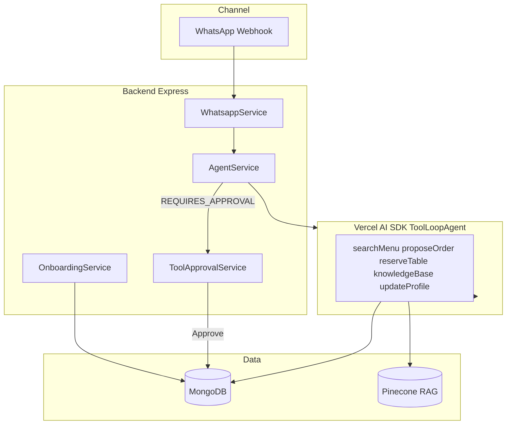

# Restaurant WhatsApp AI Agent

Production-style AI ordering system for restaurants — WhatsApp channel, validated tool-calling, owner approval, and B2B onboarding.

**Status:** Pilot stage · Branch: `feature/restaurant-whatsapp-agent`

**Demo video:** [Add your Loom/YouTube URL after recording](docs/career/DEMO_SCRIPT.md)

---

## What it does

| User | Experience |
|------|------------|
| **Customer** | Messages on WhatsApp (Roman Urdu / English) → menu search, orders, reservations |
| **Owner** | Gets Approve/Deny buttons before orders hit the kitchen |
| **You (B2B)** | Onboards new restaurants via API + onboarding agent |

**Key constraint:** The agent cannot invent menu prices. Every order is validated against MongoDB before confirmation.

---

## Architecture



### Order flow

```
Customer: "2 chicken biryani"
  → Agent calls searchMenuTool + proposeOrderTool
  → OrderValidationService checks items/prices in MongoDB
  → Customer sees Approve / Deny buttons on WhatsApp
  → Owner taps Approve
  → placeOrderAction writes order with DB prices
```

---

## Tech stack

| Layer | Technology |
|-------|------------|
| Agent | Vercel AI SDK `ToolLoopAgent`, Groq / Gemini |
| Backend | TypeScript, Express 5, Mongoose |
| Memory | MongoDB sessions, customer profiles, conversation archive |
| RAG | Pinecone, PDF ingestion |
| Channel | Meta WhatsApp Business Cloud API |
| Validation | Zod schemas, `OrderValidationService` |

---

## Project structure

```
backend/
  src/
    agents/           # Restaurant + onboarding agent factories
    modules/
      whatsapp/       # Webhook, outbound messages, approval handling
      agent/          # AgentService chat loop
      onboarding/     # B2B onboarding API
    tools/            # searchMenu, proposeOrder, reserveTable, RAG, etc.
    services/         # Order validation, approval, memory, RAG
    memory/           # WhatsApp session store
  scripts/
    eval-agent.ts     # Offline menu + order validation tests
frontend/             # Next.js dashboard (mock data — wire to API in Phase 2)
docs/
  ONBOARDING_RUNBOOK.md
  career/             # Job search materials (LinkedIn, resume, demo script)
```

---

## Quick start

```bash
cd backend
cp .env.example .env   # fill in keys
npm install
npm run dev            # http://localhost:8000
```

### Test agent (HTTP)

```bash
curl -X POST http://localhost:8000/api/v1/agent/chat \
  -H "Content-Type: application/json" \
  -d '{"sessionId": "923001234567", "query": "menu dikhao"}'
```

### Run evals (no LLM required)

```bash
npm run eval-agent
```

### Onboarding API

See [docs/ONBOARDING_RUNBOOK.md](docs/ONBOARDING_RUNBOOK.md) for full pilot workflow.

---

## API routes

| Route | Purpose |
|-------|---------|
| `POST /api/v1/agent/chat` | Customer agent chat |
| `POST /api/v1/agent/approval` | Approve/deny pending order |
| `POST /api/v1/whatsapp/webhook` | Meta WhatsApp inbound |
| `POST /api/v1/onboarding/cases` | Create B2B onboarding case |
| `POST /api/v1/onboarding/cases/:id/provision` | Provision restaurant |

---

## Guardrails

1. **Prompt** — search menu before stating prices
2. **Tools** — Zod-validated inputs (`nullableString` for Groq null quirks)
3. **Validation** — `OrderValidationService` enforces DB prices
4. **Human approval** — orders don't place until owner approves
5. **Session history** — text-only stored messages (Groq tool-replay fix)

---

## Roadmap

Deferred features: [docs/FUTURE_FEATURES.md](docs/FUTURE_FEATURES.md)

- Phase 1: Live orders dashboard
- Phase 2: Win-back campaigns
- Voice channel (ElevenLabs) — premium add-on
- Inventory agent (LangChain/LangGraph) — kitchen staff

---

## Author

Built as an applied AI / agentic systems portfolio project. Open to remote AI engineering roles.

- **Career materials:** [docs/career/](docs/career/)
- **GitHub:** https://github.com/Seyaff/sian

---

## License

ISC
